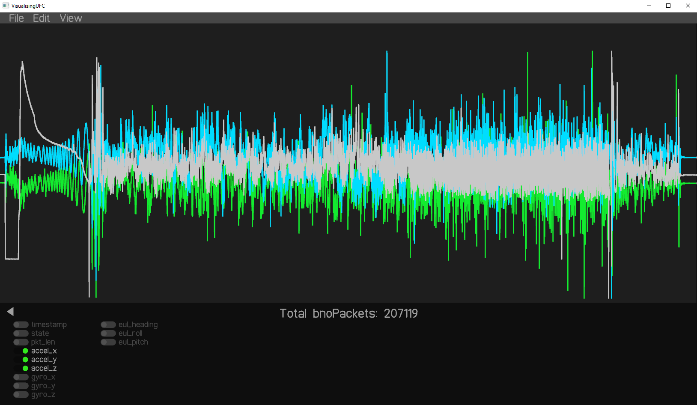
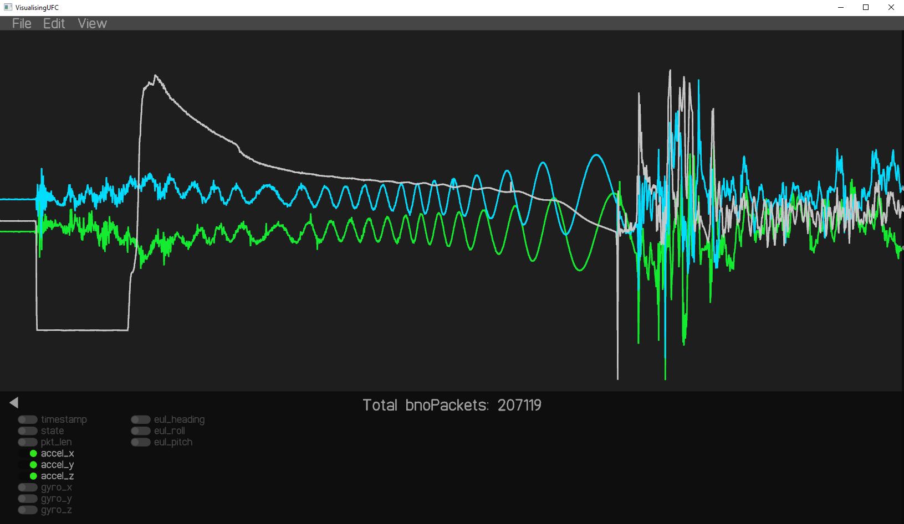

# VisualisingUFC

This program was made to analyse the [UFC](https://github.umn.edu/Rocket-Team/UFC-2024) data from IREC 2025.

Load a `txt` file containing raw bytes from the UFC's storage. This program includes basic parsing and visualisation tools.

