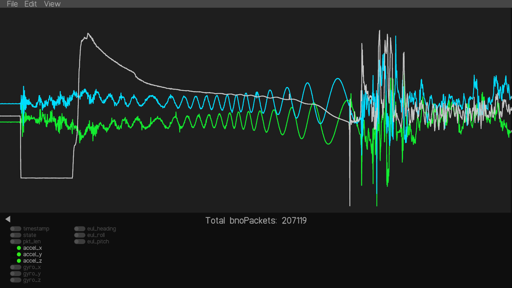
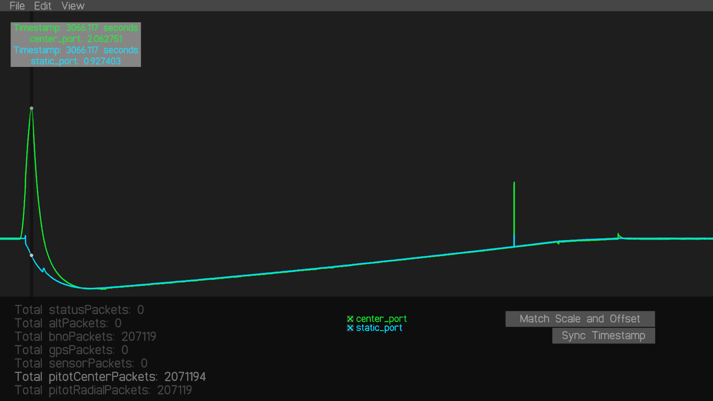

# VisualisingUFC

This program was made to analyse the [UFC](https://github.umn.edu/Rocket-Team/UFC-2024) data from IREC 2025.

Load a `txt` file containing raw bytes from the UFC's storage. This program includes basic parsing and visualisation tools.

# How to use
- Load a `txt` file with raw bytes
- Use the menu at the bottom to select graph sources
- Use the scroll wheel to zoom, hold shift to zoom only the X axis
- Up to eight sources can be graphed at a time

TODO:
- select and delete outlier points
- sync timestamp and allow timestamp offsets
- add placeable events
- export to csv